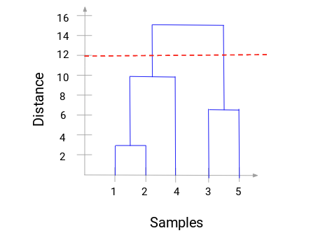

```{r setup, include=FALSE}
knitr::opts_chunk$set(echo = TRUE)
```

Clustering is a method of dividing data points in a data set into a number of
groups, or clusters, where the data points in the same group are more similar to
each other than to any data points in other groups.  This basically means that
data points within a cluster will exhibit similar traits. 

**Hierarchical clustering** is an unsupervised machine learning method.  It is 
a type of connectivity model that follows the basic rules of clustering in one 
of two ways:

### Agglomerative or Additive
* Each data point is considered as a cluster in its own right
* The proximity of individual clusters is calculated based on the chosen
proximity measure
* The two closest clusters are merged and the process is repeated by calculating
 the proximity again
 * The whole process repeats until a single merged cluster remains

### Divisive
* Exactly the opposite of the agglomerative approach
* All data points are considered as a single cluster
* In each iteration, data points which are not similar to the cluster are
seperated
* This is repeated until n clusters are formed (from n data points)

### Similarity of Clusters
The similarity of clusters can be measured in various ways:

* Max
* Min
* Group Average
* Distance between centroids

A commonly used tool is the proximity matrix which records the distance between
data points in the data space.  This distance can be also be measured using 
various methods, the choice of which is subjective:

* Euclidean distance _||a-b||2 = √(Σ(ai-bi))_
* Euclidean distance squared _||a-b||22 = Σ((ai-bi)2)_
* Manhattan distance _||a-b||1 = Σ|ai-bi|_
* Maximum distance _||a-b||INFINITY = maxi|ai-bi|_
* Mahalanobis distance _√((a-b)T S-1 (-b))_

### Dendrograms
The hierarchy of clusters can be represented in a tree-like diagram known as a 
**dendrogram**.  The branches show the hierarchy of the clusters and the height
at which two clusters merge represents the distance between the two clusters in
the data space.  The dendrogram is also used to decide on the optimum number of 
clusters in a data set.  This is done by deciding on a threshold distance
between data points and drawing a horizontal line.  It is usually set so that it
intersects the tallest vertical line.  the The number of clusters then
equals the number of vertical lines intersected by this threshold line.




Advantages 

* Easy to interpret
* Results are reproducible
* No need to specify the number of clusters required

Disadvantages

* Lacks scalability for handling large data sets
* Difficult to interpret dendrogram for large numbers of clusters

### Areas of Application  

* Animal evolution phylogenetic trees
* Virus evolution phylogenetic trees
* Gene expression profile analysis


### Example Use-Case  

Hierarchical clustering was used as evidence in a criminal court case to convict 
a doctor who had injected a former partner with the HIV virus using blood products
obtained from one of his patients.

Phylogenetic analyses using hierarchical clustering was carried out to determine 
the HIV virus strain the victim was carrying and this was traced back to a similar
strain in the doctors patient.

Reference https://www.pnas.org/content/99/22/14292


